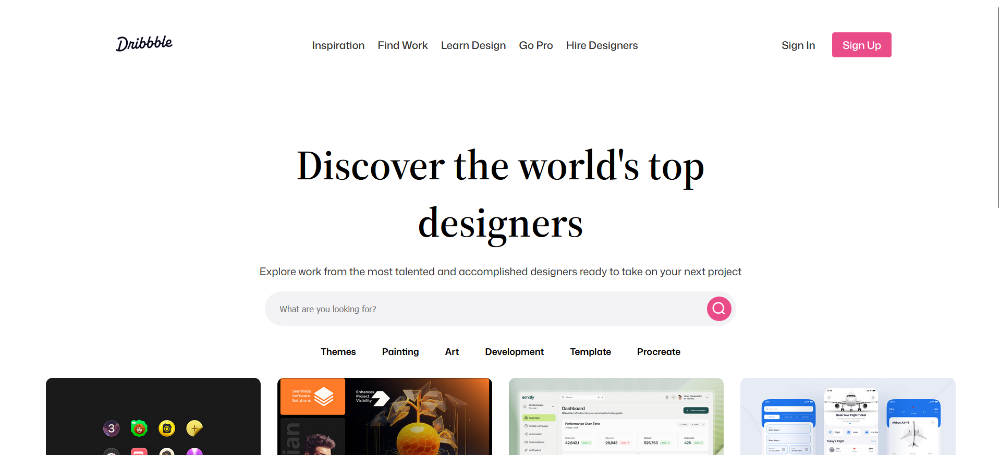

<h2 align="center"><u>Dribbble Clone</u></h2>

<h4 align="center"> To create a dribble like exact clone for Jekyll; for showcasing of projects </h4>

    
    
    
    
    
 
    
    
    
    
    

### [+] Description
This project allows to create a dribble like Jekyll showcasing template for your next project

### [+] Installation
`Bundle install`

### [+] Usage
`bundle exec jekyll serve`

### [+] Screenshot

### [+] Features
 - [x] Dribbble shorts
 - [x] Search feature added
 - [x] SEO
 - [x] Author details
 - [x] Shot Discription with gallery, buttons and shot description
 - [x] Footer
 - [ ] Netlify CMS

### [+] Credits 
<a href="https://github.com/muhashfar/Dribbble-clone">muhashfar</a>

### [+] Find me on 

